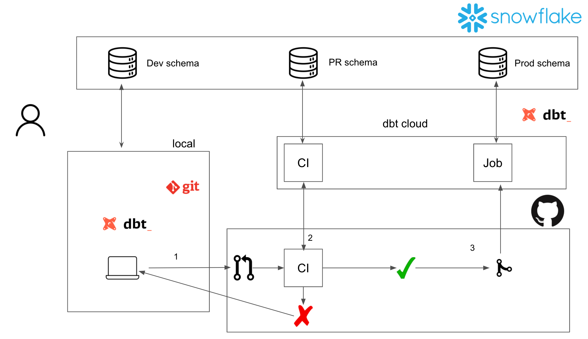

# DBT Bible

## Which EL tool is preferred:

Most Data Engineers presented with this question chose Airflow, followed by FiveTran and AirByte as a prominent third option. However, for DBT-specific projects, AirByte tailors specifically to DBT as transformation tool and given that AirByte is only in it’s Alpha stage, this functionality is bound to be expanded upon in the future.

## Scoping a DBT-project

A project should target a single group of related sources on a single warehouse.

Perform source analysis before writing any models. Identify contraints and relationships in a sources.yml file (under {PROJECT_HOME}/models/sources/)

## GIT strategy:

DBT prefers and essentially enforces the GIT-flow methodology where the main branch is used for production-ready code. Development of any and all features are done in separate branches linked to a single transformation or group of transformations.

Pull requests should:

- tackle a functional grouping of work.
- include a body that explains the context of the changes to the code, as well as what the code does.
- be opened with 48 hours for the reviewer to review
- be merged by its *author* when:
    - approval has been given by at least one collaborator
    - all tests have passed

## Starting a new DBT project

### Using VS Code

**Requires Docker**
To use this repo to quickstart a DBT-project in VS Code, you need to have the following extensions installed:

- Docker (ms-azuretools.vscode-docker)
- Remote - Containers (ms-vscode-remote.remote-containers)

Run command **Clone repository in Container Volume**
‣ -> main branch

### Using local DBT installation

1. Clone ‣ to desired location
2. Backup any existing profiles.yml (usually at $HOME/.dbt/profiles.yml):

```bash
cp $HOME/.dbt/profiles.yml $HOME/.dbt/profiles.backup.yml
```

1. Run dbt_init.py script:

```bash
chmod +x dbt_init.py && python dbt_init.py
```

## Coding conventions

- Naming
    - files and functions should be all lowercase + underscore(s) as separator
- Describe a source before referencing it in any model or analysis
- Document
- Macros
    - Should be written as generically as possible.
    - Should be called at least once in the project.
    - Should be documented thoroughly; author@date, functionality

If possible, use sqlfluff as a linter.

### Staging layer conventions:

the most standard types of staging model transformations are:

- ✅ **Renaming**
- ✅ **Type casting**
- ✅ **Basic computations** (e.g. cents to dollars)
- ✅ **Categorizing** (using conditional logic to group values into buckets or booleans, like using `case when`)
- ❌ **Joins** (exceptions are possible)
- ❌ **Aggregations**

Staging should be the only layer where {{ source(’schema_name’, ’table_name’) }} is used and should not contains any {{ ref(’model_name’) }}.

All models in staging should be materialized as views.

**It is possible to use [Codegen](https://github.com/dbt-labs/dbt-codegen) to automate staging table generation. This is done for you if using the previously mentioned repository.**

## Testing

Whenever possible, testing should be done using either one the vanilla checks;

```yaml
version: 2
models:
  - name: tablename
    columns:
      - name: some_fk_col
        tests:
          - unique
          - not_null
      - name: some_col
        tests:
          - accepted_values:
              values: ['0', '1', 'y', 'n']
      - name: some_id_col
        tests:
          - relationships:
              to: ref('some_other_table')
              field: id
```

Or more advanced tests using the dbt-utils package;

```yaml
version: 2
models:
  - name: tablename
    columns:
      - name: id
        tests:
          - dbt_utils.not_null_proportion:
              at_least: 0.95
      - name: some_col1
        tests:
          - dbt_utils.expression_is_true:
              expression: '>= 1'
      - name: some_col2
        tests:
          - dbt_utils.expression_is_true:
              expression: '= 1'
              condition: "last_load_date < '2100-01-01'"
```

And lots more tests, which you can check out on this repository:

[https://github.com/dbt-labs/dbt-utils](https://github.com/dbt-labs/dbt-utils)

It’s possible to create custom generic tests. They have to be located under ./tests/generic/ to be recognized as such. Here is how you would write a basic test and use in in your sources file:

```sql

	select {{ column_name }} company from {{ model }} where company = 'DATASENSE'

```

```yaml
version: 2
models:
  - name: companies
    columns:
      - name: company_name
        tests:
          - company_is_awesome
```

The rows that do not pass testing are logged to console by default. To change this behaviour and **store the values that didn’t pass, the store_failures flag can be set to true**. This can be done either project-wide or for a specific folder (both using +store_failures: true). They can also be saved for a specific model (in models/.../modelname.yml) or in a specific test (by adding `{{ config(store_failures = true) }}` to the top of the testfile).

## Which Scheduling tool is preferred:

DBT Cloud has scheduling built-in under ‘Deployment’ → ‘Jobs’ with the option to choose a set time interval or provide a custom cron interval.

GitHub Actions can be used for scheduling as well if the project does not use DBT Cloud (or if you prefer this over the built-in scheduler). Can use cron interval as well. 

Airflow can be used to trigger a dbt project using a custom script. Airflow most expansive but is a  non-free option. More in-depth analysis required for this workflow.

## Overview



## How to prepare DBT Cloud project for CI/CD

Configure deployment environment:


Create Cloud Job:


Grab account_id and job_id from URL

…/#/accounts/{account_id}/projects/{project_id}/jobs/{job_id}/

Generate API key under API Access

Pass API-key, account_id and job_id to scheduler

## Sources:

- [https://notion.castordoc.com/catalog-of-etl-tools](https://notion.castordoc.com/catalog-of-etl-tools)
- [https://www.reddit.com/r/dataengineering/comments/pbaw2f/what_etl_tool_do_you_use/](https://www.reddit.com/r/dataengineering/comments/pbaw2f/what_etl_tool_do_you_use/)
- [https://www.getdbt.com/analytics-engineering/transformation/git-workflow/](https://www.getdbt.com/analytics-engineering/transformation/git-workflow/)
- [https://www.startdataengineering.com/post/cicd-dbt/](https://www.startdataengineering.com/post/cicd-dbt/)

version: 2

models:

- name: users
columns:
    - name: favorite_number
    tests:
        - is_even
